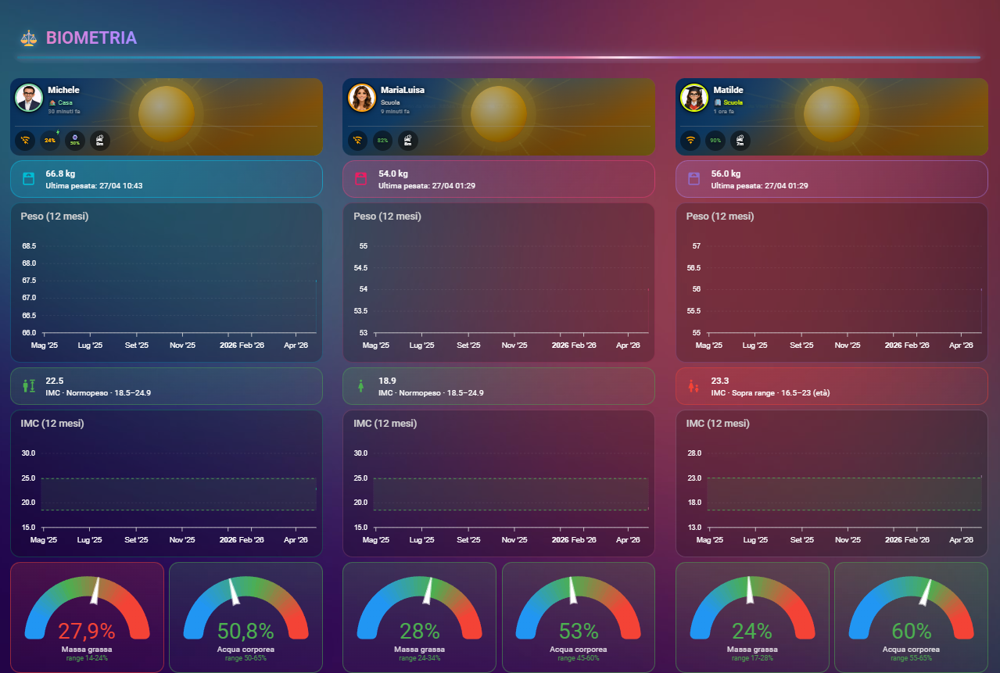
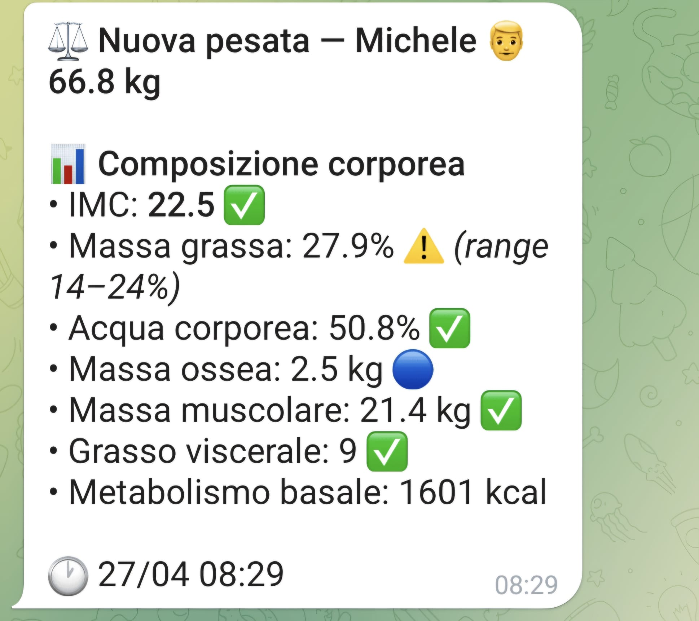

# Mondeer Bluetooth scale — Home Assistant integration

A Python BLE listener for **Mondeer Bluetooth bathroom scales** (and
the OEM family they belong to), with a Home Assistant integration via
MQTT.

The original Android app (`com.mondeer.scale`) stopped working on
Android 14+ and the manufacturer never released an update. This project
is the result of reverse-engineering the BLE protocol used by that app,
then re-implementing it in Python so the scale can be used **without
any phone**: a small always-on PC near the scale captures every
weighing and pushes the data to Home Assistant.

> **Status:** working in production (one family of three, daily use).
> Tested on Windows 11. Linux/BlueZ should work but has had less testing.



A weighing in action (10 s clip — step on the scale, the listener catches
the BLE advertising, the Telegram notification arrives):

https://github.com/user-attachments/assets/824917a9-eb28-4c1b-8bd9-1f998bba79bc

Telegram notification example:



---

## Features

- **No phone required**: any always-on PC with BLE 4.0+ acts as the bridge
- **Full body composition**: weight, fat %, water %, bone, muscle,
  visceral fat, BMR (kcal), BMI — same values the Android app showed
- **Multi-user**: up to 8 family profiles registered in the scale
- **Italian-style HA dashboard** included (3-column family view) — easily
  re-skinnable
- **Single Telegram notification per weighing** (filters out preliminary
  records before BIA finishes)
- **Robust against unstable BT chipsets**: configurable auto-recovery,
  intelligent backoff, optional pre-pairing
- **No Android app needed** — the scale is fully driven from Python

---

## How it works

```text
   ┌───────────┐  BLE   ┌──────────────────┐   MQTT   ┌─────────────────┐
   │  Mondeer  │◀──────▶│  Listener (PC)   │─────────▶│ Mosquitto       │
   │   scale   │        │  Python + Bleak  │          │ + Home Assistant│
   └───────────┘        └──────────────────┘          └─────────────────┘
       ~10s window                                       sensors, dashboard,
       per weighing                                      automations, Telegram
```

The scale powers on for ~10 seconds when somebody steps on it,
advertises a BLE peripheral with primary service UUID `0xcc08`, then
powers off. The listener keeps a permanent BLE scanner running,
connects on-the-fly when the advertising packet appears, and runs the
full handshake (binding → profile registration → time sync) in well
under one second so there is enough time left for the BIA measurement
to complete.

A more detailed protocol description lives in
[docs/PROTOCOL.md](docs/PROTOCOL.md). The reverse-engineering methodology
is in [docs/REVERSE_ENGINEERING.md](docs/REVERSE_ENGINEERING.md).

---

## Quick start

### 1. Listener side (any PC near the scale)

Requires **Python 3.10+** and a working BLE adapter (BT 4.0 or newer).

```bash
git clone https://github.com/MicheleMercuri/mondeer-bluetooth-scale-ha.git
cd mondeer-bluetooth-scale-ha
python -m venv .venv
.venv/bin/pip install -r listener/requirements.txt   # Linux/macOS
# .venv\Scripts\pip install -r listener/requirements.txt   # Windows

cp listener/config.example.yaml listener/config.yaml
# edit listener/config.yaml: HA url, MQTT credentials, family profiles

python -m listener.scale_listener
```

Step on the scale and watch the log: you should see
`scale advertising` → `connect OK` → `VALID WEIGHT ...kg fat=...%`.

For Windows installation as a background service (auto-start at logon,
auto-restart on crash) see [deploy/windows/README.md](deploy/windows/README.md).
For systemd see [deploy/linux/README.md](deploy/linux/README.md) (TODO).

### 2. Home Assistant side

Copy [home_assistant/packages/bilancia.yaml](home_assistant/packages/bilancia.yaml)
into your HA `config/packages/` directory. It declares:

- 3 MQTT sensors `sensor.peso_<name>` (one per family profile)
- helper entities `input_select`/`input_number` for sex, age, height,
  weight range — editable from the dashboard
- template sensors for derived metrics (BMI, statuses, deltas)
- a Telegram notification automation (with `is_complete`-aware filter)

Then add the dashboard view from
[home_assistant/dashboards/bilancia.yaml](home_assistant/dashboards/bilancia.yaml)
to your Lovelace config.

Full HA integration guide: [docs/HOME_ASSISTANT.md](docs/HOME_ASSISTANT.md).

---

## Compatibility

Mondeer scales share the same Bluetooth chip and protocol with several
other rebranded models from the same OEM family. This listener should
work — possibly with minimal tweaks — on any BLE bathroom scale that:

- Advertises a primary BLE service `0xcc08`
- Sends 32-byte weight records on `cmd=2 data=4`

Technical names of identified compatible advertising patterns are
documented in [docs/PROTOCOL.md](docs/PROTOCOL.md).

Reports of working/non-working scales are very welcome — open an issue
with the device name, BT MAC OUI, and a couple of `pkt dev=...` log lines.

---

## Repo layout

```text
.
├── listener/                  # Python BLE listener + MQTT publisher
│   ├── parser.py              # 20-byte BLE packet decoder, frame reassembly
│   ├── scale_listener.py      # main loop, BLE state machine
│   ├── ha_push.py             # MQTT publish + body comp memory
│   ├── config.py              # YAML + env vars config loader
│   ├── config.example.yaml    # template (copy to config.yaml)
│   └── requirements.txt
├── home_assistant/
│   ├── packages/bilancia.yaml # MQTT sensors + helpers + automation
│   └── dashboards/bilancia.yaml
├── deploy/
│   └── windows/               # PowerShell scripts for Task Scheduler
└── docs/
    ├── PROTOCOL.md            # BLE protocol description
    ├── REVERSE_ENGINEERING.md # methodology used to derive the protocol
    ├── DEPLOY.md              # deployment notes (Windows/Linux)
    └── HOME_ASSISTANT.md      # MQTT + HA integration details
```

---

## License

MIT — see [LICENSE](LICENSE).

This project is **not affiliated with Mondeer or CE-Link**. The reverse
engineering was carried out under the interoperability exception of EU
Directive 2009/24/EC (Art. 6) and the equivalent USA DMCA §1201(f). No
code from the original Android APK is redistributed; only the *protocol*
derived from observation and analysis is documented here.

---

## Acknowledgements

- [Bleak](https://github.com/hbldh/bleak) — the only sane way to do BLE
  in Python on Windows
- [Home Assistant](https://www.home-assistant.io/) — the home automation
  platform this integrates with
- [JADX](https://github.com/skylot/jadx) — used to decompile the Android
  APK during the reverse engineering phase
